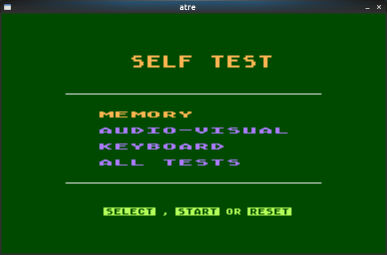

## atre

Simple 8-bit Atari platform (800XL/65XE) emulator in C++ (_work in progress!_)

### Project goals

* MOS 6502 CPU emulation - done!
* Graphics and IO chipsets emulation - partial
* boot original Atari OS - done!
* run Atari BASIC - done!
* pass Self Test - partial
* run a simple game - pending

### Screenshots

###### Original Atari BASIC

###### XL/XE Self-Test

### Code

Reference build using GCC in C++ 17 mode on Ubuntu and SDL library for graphics.

In order to boot you will need original Atari OS ROM (_REV02.ROM_) and BASIC ROM (_REVC.ROM_).

The focus of the project is on producing a working version first with optimisations
and design rationalisation coming later (time-peritting).

### Thanks

Big thanks in particular to:

* Klaus for his 6502 functional tests: https://github.com/Klaus2m5/6502_65C02_functional_tests

* Avery for his Altirra emulator and fantastic documentation: http://www.virtualdub.org/altirra.html

* everyone else who keeps archives of 8-bit platform docs and sources running!
