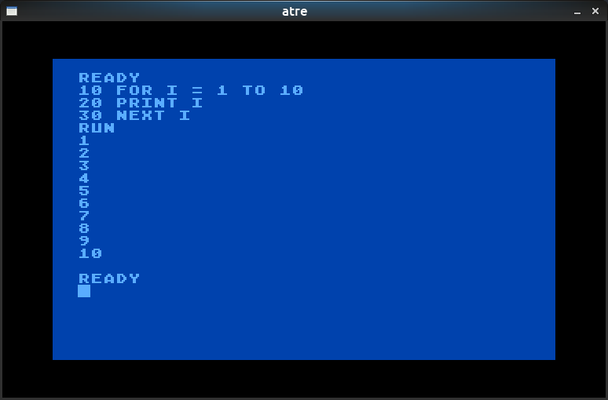

## atre

Simple 8-bit Atari platform (XL/XE) emulator in C++

### Features

* Full MOS 6502 CPU emulation
* Graphics/IO hardware registers emulation
* boots original Atari XL OS
* runs Atari BASIC
* passes Self Test
* runs a few classic games

Only the necessary features to run the above have been implemented,
the project doesn't aspire to compete with any well-established emulators!

Feel free to try running your favourite game and enhancing the emulator to
do so correctly.

### Screenshots

###### Original BASIC

###### Self-Test

###### Classic Game

###### Debugger

### Code

Cross-platform C++ 17 using SDL2 for graphics and IO, tested on:

* g++ 8.2 on Ubuntu 18.04
* clang++ 6.0 on Ubuntu 18.04
* MSVC++ 14.16 (VS 2017) on Windows 10 1809

In order to start the emulator you will need an Atari OS ROM and
either the BASIC ROM or a external game ROM (cartridge). Type _help_ in
the debugger window for more info. No ROMs included in this repository!

### Thanks

Big thanks in particular to:

* Klaus for his 6502 functional tests: https://github.com/Klaus2m5/6502_65C02_functional_tests

* Avery for his Altirra emulator and fantastic documentation: http://www.virtualdub.org/altirra.html

* everyone else who keeps archives of 8-bit platform docs and sources running!
